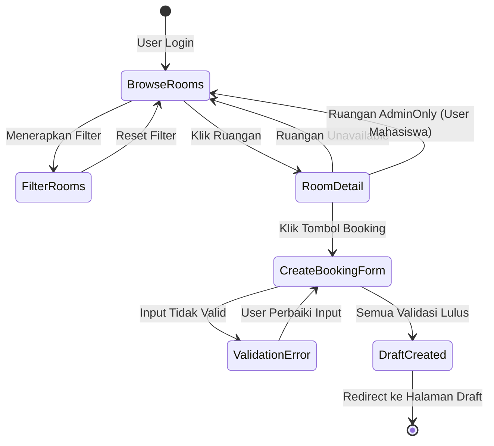
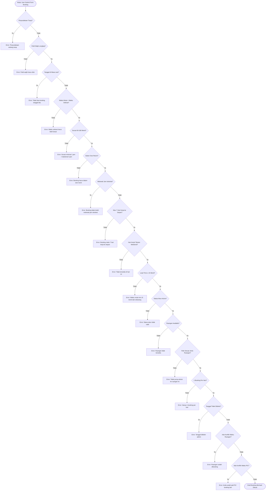

# MASTER TEST PLAN PENGUJIAN PERANGKAT LUNAK  
# SISTEM LIBRARY BOOKING APP  
## Modul: Create Booking (View Room & Time Rules)

**Disusun Oleh:**
* Boy Ishwara Aditama

**PROGRAM STUDI TEKNIK INFORMATIKA**  
**UNIVERSITAS BRAWIJAYA**  
**MALANG**  
**2026**

---

## LIBRARY BOOKING TEST DESIGN SPECIFICATION
**Library Booking App – Phase 1 Testing**

### Version History
| Version | Tanggal | Penulis | Status |
| :--- | :--- | :--- | :--- |
| 1.00 | 05-06-2026 | Boy Ishwara Aditama | Draft |

### Daftar Isi Dokumen
* Test Plan Identifier
* Introduction
* Test Item(s)
* Features to be Tested
* Features Not to be Tested
* Approach/Strategy
* Item Pass/Fail Criteria
* Suspension Criteria and Resumption Requirements
* Test Deliverables
* Remaining Test Tasks
* Test Environments
* Responsibilities
* Staffing and Training Needs
* Schedule
* Risks and Contingencies

---

## A. Test Plan Identifier

Identifier untuk Test Plan dokumen ini adalah **LBATP-BOY-001**, sedangkan untuk Test Design adalah **LBATD-BOY-001**, Test Procedure adalah **LBATPR-BOY-001**, Test Case adalah **LBATC-BOY-001**, dan Test Summary adalah **LBATS-BOY-001**. Dokumen ini secara utama berdasarkan pada standar **IEEE 829-1998** untuk dokumentasi pengujian perangkat lunak.

Ruang lingkup dokumen ini mencakup **pengujian fitur Create Booking (termasuk View Room dan Time Rules)** pada Library Booking App, yang merupakan tanggung jawab **Boy Ishwara Aditama** dalam pembagian tugas kelompok.

---

## B. Introduction

Library Booking App adalah sistem peminjaman ruangan perpustakaan berbasis web yang memungkinkan pengguna (mahasiswa, dosen, dan tendik) untuk melakukan peminjaman ruang secara online. Sistem ini dibangun menggunakan arsitektur MVC dengan PHP, dan memiliki alur booking yang ketat meliputi tahapan: **Draft → Pending → Verified → Active → Completed**.

Proses **Create Booking** merupakan titik masuk (entry point) dari seluruh alur booking. Pengujian pada bagian ini berfokus pada:
1. **View Room**: Kemampuan pengguna melihat daftar ruangan, detail ruangan, ketersediaan (availability), serta aturan akses berdasarkan role.
2. **Create Booking (Draft)**: Validasi semua aturan bisnis saat pengguna membuat draft booking, mulai dari validasi field wajib, aturan waktu (time rules), aturan sesi, aturan lead time, hingga pengecekan konflik.

Pengujian ini mencakup seluruh aturan validasi yang didefinisikan dalam `Booking Rules.txt` dan diimplementasikan dalam `BookingService::validateBookingRules()` dan `BookingService::validateNoTimeConflicts()`.

---

## C. Test Item(s)

Batasan dari pengujian ini mencakup **Library Booking App v1.0**, khususnya pada:

| No. | Komponen | File/Modul | Fungsi Utama |
| :--- | :--- | :--- | :--- |
| 1 | UserRoomController | `App/Controllers/UserRoomController.php` | index(), show() |
| 2 | RoomService | `App/Services/RoomService.php` | getAllRooms(), getRoomById(), getRoomAvailability() |
| 3 | UserBookingController | `App/Controllers/UserBookingController.php` | createDraft() |
| 4 | BookingService (Validasi) | `App/Services/BookingService.php` | validateBookingRules(), validateNoTimeConflicts(), validateRequiredFields(), validateNotPastBookings(), validateTimeOrder(), validateDuration(), validateSessionHours(), validateBreakTime(), validateMaxDaysAhead(), validateMinLeadTime(), validateUserStatus(), validateRoomAvailable(), validateUserRoleCanBookRoom(), validateOneBookingPerDay(), validateDateNotBlocked(), validateRoomNoOverlap(), validatePicNoOverlap() |
| 5 | View: Rooms Index | `App/Views/User/Rooms/Index` | Halaman daftar ruangan |
| 6 | View: Room Show | `App/Views/User/Rooms/Show` | Halaman detail ruangan |
| 7 | View: Create Booking Form | Form create draft booking | Form input booking |

---

## D. Features to be Tested

Tahapan pengujian ini terfokus pada fitur-fitur berikut (sesuai cakupan **Boy Ishwara Aditama**):

### D.1 View Room (Melihat Daftar Ruangan)
a. Menampilkan daftar semua ruangan yang tersedia  
b. Filter ruangan berdasarkan nama, jenis, status, kapasitas min/max  
c. Paginasi daftar ruangan  
d. Akses kontrol: ruangan `adminOnly` hanya tampil untuk Admin/Dosen/Tendik  
e. Ruangan `unavailable` tidak dapat diakses oleh siapapun  

### D.2 View Room Detail (Melihat Detail Ruangan)
a. Menampilkan informasi lengkap ruangan (nama, kapasitas, jenis, deskripsi, foto, fasilitas)  
b. Menampilkan jadwal ketersediaan ruangan untuk 7 hari ke depan  
c. Akses kontrol detail ruangan: ruangan `adminOnly` hanya untuk Admin/Dosen/Tendik  
d. Redirect ke daftar ruangan jika ID tidak ditemukan  

### D.3 Create Booking – Validasi Field Wajib (Rule 1 & 2)
a. Booking tanpa tujuan/purpose ditolak (Rule 1)  
b. Booking tanpa tanggal ditolak (Rule 2)  
c. Booking tanpa waktu mulai ditolak (Rule 2)  
d. Booking tanpa waktu selesai ditolak (Rule 2)  

### D.4 Create Booking – Validasi Waktu (Time Rules)
a. Booking di masa lalu ditolak (Rule 3)  
b. Waktu mulai harus lebih awal dari waktu selesai (Rule 4)  
c. Durasi minimum 1 jam (60 menit) (Rule 8)  
d. Durasi maksimum 3 jam (180 menit) (Rule 8)  
e. Booking di luar sesi resmi ditolak – Session 1: 08:15–10:55, Session 2: 13:15–16:00 (Rule 9)  
f. Booking tidak boleh melewati jam istirahat Senin–Kamis: 11:00–12:00 (Rule 17)  
g. Booking tidak boleh melewati jam istirahat Jumat: 11:00–13:00 (Rule 17)  
h. Booking tidak boleh berakhir setelah 16:00 (Rule 18)  
i. Booking tidak boleh dimulai sebelum 08:15 (Rule 20)  
j. Lead time minimal 15 menit sebelum waktu mulai (Rule 14)  

### D.5 Create Booking – Validasi Tanggal & Hari
a. Booking tidak bisa lebih dari 7 hari kerja ke depan (Rule 11)  
b. Booking di akhir pekan (Sabtu/Minggu) ditolak (Rule 11)  
c. Booking pada tanggal yang diblokir admin ditolak (Rule 21)  

### D.6 Create Booking – Validasi User & Role
a. User harus login (status active) untuk membuat booking (Rule 15)  
b. User dengan status suspended tidak bisa booking (Rule 15 + Penalty Rules)  
c. User dengan status pending kubaca tidak bisa booking  
d. User role Mahasiswa tidak bisa booking ruangan adminOnly (Rule 10)  
e. User role Dosen/Tendik bisa booking ruangan adminOnly (Rule 10)  
f. 1 booking per hari per user (Rule 22)  
g. User tidak bisa membuat booking saat perpustakaan tutup (sistem maintenance/closure)  

### D.7 Create Booking – Validasi Konflik Waktu
a. PIC tidak bisa booking di waktu yang bertabrakan dengan booking verified/active miliknya (Rule 5)  
b. Ruangan tidak bisa dibooking jika sudah ada booking verified/active pada waktu yang sama (Rule 6)  
c. PIC tidak bisa booking di waktu yang bertabrakan dengan booking member miliknya  

### D.8 Create Booking – Validasi Ruangan
a. Ruangan harus berstatus available (Rule 7)  
b. Ruangan unavailable tidak bisa dibooking (Rule 7)  
c. Ruangan yang require special approval memerlukan upload surat (dokumen wajib)  
d. Upload surat: format harus PDF/JPG/PNG  
e. Upload surat: ukuran maksimal 2MB  

### D.9 Create Booking – Validasi Library Closure
a. Booking tidak bisa dibuat saat perpustakaan tutup (semua ruangan diblokir) (Rule 16)  
b. Admin bypass closure check (dapat membuat booking meski perpustakaan tutup)  

---

## E. Features Not to be Tested

Fitur-fitur berikut **tidak** diuji dalam lingkup dokumen ini (sudah menjadi tanggung jawab anggota kelompok lain):

| No. | Fitur | PIC |
| :--- | :--- | :--- |
| 1 | Booking Draft → Pending (submit draft, manajemen member, join/kick) | Muhammad Reza Hafizzi |
| 2 | Reschedule Booking | Muhammad Reza Hafizzi |
| 3 | Booking Pending → Verified → Active (Admin approval, check-in) | Muhammad Reza Hafizzi & Adelio |
| 4 | Booking Active → Completed | Adelio Rais Fikri |
| 5 | Admin CRUD Booking, Room, Laporan | Muhammad Rizki Syahputra |
| 6 | Registrasi, Login, Verifikasi akun | Yusuf Hamzah Taufiqurrahman |
| 7 | Fitur Feedback/Penilaian | Di luar cakupan semua anggota |
| 8 | Notifikasi Email | Di luar cakupan langsung pengujian manual |

---

## F. Approach/Strategy

### F.1 Prioritas Test Case
Setiap Test Case diprioritaskan dengan tingkatan:
- **High**: Validasi bisnis kritis (waktu, ruangan, user status, konflik)
- **Medium**: Validasi UI dan filter ruangan
- **Low**: Edge case dan boundary condition sekunder

### F.2 Jenis Pengujian

#### F.2.1 Function Testing (Black Box)
- **Tujuan**: Memastikan semua aturan validasi booking berfungsi sesuai spesifikasi di `Booking Rules.txt`
- **Teknik**: Menginput data dan memverifikasi response/error message yang muncul
- **Kriteria Selesai**: Semua validasi menolak input tidak valid dan menerima input valid

#### F.2.2 Boundary Value Analysis
- **Tujuan**: Menguji nilai-nilai batas pada aturan durasi (60 menit, 180 menit), lead time (15 menit), dan hari ke depan (7 hari)
- **Teknik**: Menginput nilai tepat di batas bawah, di batas, dan di atas batas
- **Kriteria Selesai**: Sistem berperilaku benar di setiap nilai batas

#### F.2.3 Equivalence Partitioning
- **Tujuan**: Menguji grup input yang setara untuk efisiensi pengujian
- **Teknik**: Membagi input menjadi partisi valid dan tidak valid
- **Kriteria Selesai**: Setiap partisi menghasilkan perilaku yang konsisten

#### F.2.4 Decision Table Testing
- **Tujuan**: Menguji kombinasi kondisi pada aturan sesi dan jam operasional
- **Teknik**: Membuat tabel kondisi-aksi untuk setiap aturan waktu
- **Kriteria Selesai**: Semua kombinasi kondisi menghasilkan aksi yang benar

#### F.2.5 State Transition Testing (White Box Tambahan)
- **Tujuan**: Memverifikasi alur kontrol validasi di BookingService
- **Teknik**: Menelusuri jalur kode pada `validateBookingRules()` dan sub-fungsinya
- **Kriteria Selesai**: Semua jalur kode yang relevan tereksekusi

#### F.2.6 UI Testing
- **Tujuan**: Memverifikasi tampilan form booking dan halaman daftar/detail ruangan
- **Teknik**: Inspeksi visual dan fungsional pada elemen form, tombol, tabel, dan link
- **Kriteria Selesai**: Semua elemen UI terletak dengan benar dan user-friendly

### F.3 Metode Pelaksanaan
Semua pengujian dilakukan secara **manual** dengan akun uji yang sudah disiapkan.

---

## G. Item Pass/Fail Criteria

### Kriteria Lulus (Pass)
- Sistem menolak semua input yang melanggar aturan bisnis dengan pesan error yang jelas dan akurat
- Sistem menerima dan memproses semua input yang valid dengan redirect ke halaman draft yang sesuai
- Halaman View Room menampilkan data ruangan yang benar sesuai role user
- Semua pesan error sesuai dengan yang didefinisikan dalam kode (`BookingService.php`)
- Tidak ada uncaught exception atau server error (HTTP 500) pada kasus valid maupun invalid

### Kriteria Gagal (Fail)
- Sistem menerima input yang seharusnya ditolak (false positive)
- Sistem menolak input yang seharusnya diterima (false negative)
- Pesan error tidak muncul atau tidak informatif saat validasi gagal
- Terjadi server error (HTTP 500) pada kasus apapun
- Halaman tidak dapat diakses atau mengalami redirect yang salah
- Data yang ditampilkan tidak konsisten dengan database

---

## H. Suspension Criteria and Resumption Requirements

### Kriteria Penghentian (Suspension)
Pengujian akan dihentikan sementara apabila:
1. **Server/Localhost Down**: Web server (Apache/PHP) tidak dapat dijalankan
2. **Database Error**: Koneksi ke database MySQL/MariaDB gagal atau terjadi corrupt data
3. **Critical Bug Blocking**: Ditemukan bug kritis yang menghalangi semua test case untuk dieksekusi (contoh: halaman create booking tidak bisa diakses sama sekali)
4. **Perubahan Kode Major**: Terjadi perubahan arsitektur kode yang mempengaruhi validasi booking saat pengujian sedang berjalan

### Kriteria Lanjutan (Resumption)
Pengujian dapat dilanjutkan kembali apabila:
1. Server/localhost sudah dapat berjalan kembali dengan normal
2. Database sudah dapat diakses dan data test sudah direstorasi
3. Bug kritis yang memblokir sudah diperbaiki oleh developer
4. Perubahan kode sudah didokumentasikan dan test case yang terpengaruh sudah diperbarui

---

## I. Test Deliverables

Dokumen-dokumen berikut akan dihasilkan setelah aktivitas pengujian selesai:
1. **Master Test Plan** (dokumen ini) – LBATP-BOY-001
2. **Test Design Specification** – LBATD-BOY-001
3. **Test Procedure Specification** – LBATPR-BOY-001
4. **Test Case Specification** – LBATC-BOY-001
5. **Test Log** – Catatan eksekusi setiap test case
6. **Test Incident Report** – Bug report untuk setiap kegagalan yang ditemukan
7. **Test Summary Report** – LBATS-BOY-001

---

## J. Remaining Test Tasks

Setelah pengujian selesai dan semua test deliverables lengkap, kegiatan pengujian dinyatakan selesai. Pengecualian berlaku jika:
- Terdapat bug yang ditemukan dan perlu dilakukan regression testing setelah perbaikan
- Terjadi perubahan aturan bisnis yang memerlukan pembaruan test case
- Diperlukan pengujian lanjutan pada integrasi dengan modul lain (contoh: interaksi dengan modul admin verification)

---

## K. Test Environments

| Komponen | Spesifikasi |
| :--- | :--- |
| **OS** | Windows 10/11 |
| **Web Server** | Apache (via XAMPP/Laragon) |
| **PHP Version** | PHP 8.x |
| **Database** | MySQL/MariaDB |
| **Browser** | Google Chrome (latest) |
| **Koneksi** | Localhost |
| **Framework** | Custom MVC PHP (tidak menggunakan Laravel/CodeIgniter) |
| **Dependency** | Carbon (date manipulation), Composer packages |

### Akun Uji yang Diperlukan
| Role | Username/NIM | Status | Tujuan |
| :--- | :--- | :--- | :--- |
| Mahasiswa | test_mhs@ub.ac.id | active | Pengujian booking umum |
| Mahasiswa Suspended | suspended_mhs@ub.ac.id | suspended | Pengujian akun suspended |
| Mahasiswa Pending Kubaca | pending_mhs@ub.ac.id | pending kubaca | Pengujian akun belum verifikasi |
| Dosen/Tendik | test_dosen@ub.ac.id | active | Pengujian akses ruangan adminOnly |
| Admin | admin@ub.ac.id | active | Pengujian bypass library closure |

### Data Ruangan yang Diperlukan
| Nama Ruangan | Status | Jenis | Kapasitas Min | Kapasitas Max | Requires Special Approval |
| :--- | :--- | :--- | :--- | :--- | :--- |
| Ruang Diskusi A | available | diskusi | 2 | 8 | Tidak |
| Ruang Seminar B | available | seminar | 5 | 20 | Ya |
| Ruang VIP C | adminOnly | vip | 2 | 10 | Tidak |
| Ruang Maintenance D | unavailable | diskusi | 2 | 6 | Tidak |

---

## L. Responsibilities

| Penguji | Tanggung Jawab |
| :--- | :--- |
| Boy Ishwara Aditama | Test Plan, Test Design, Test Procedure, Test Case, Test Summary (seluruh dokumen untuk modul Create Booking - View Room & Time Rules) |

---

## M. Staffing and Training Needs

Penguji pada pengujian ini dipastikan memenuhi standar keterampilan berikut:
1. Pemahaman dasar alur HTTP Request-Response pada aplikasi web
2. Kemampuan membaca dan memahami kode PHP (Controller, Service, Model)
3. Pemahaman aturan bisnis Library Booking App (Booking Rules.txt)
4. Kemampuan mengoperasikan browser dan tools developer
5. Pemahaman standar dokumentasi pengujian IEEE 829

---

## N. Schedule

| Aktivitas | Estimasi Hari |
| :--- | :--- |
| Test Design | 1 hari |
| Test Procedure | 1 hari |
| Test Case Writing | 2 hari |
| Eksekusi Pengujian | 2 hari |
| Penulisan Test Summary | 1 hari |
| **Total** | **7 hari** |

---

## O. Risks and Contingencies

| No. | Risiko | Kemungkinan | Dampak | Rencana Cadangan |
| :--- | :--- | :--- | :--- | :--- |
| 1 | Server localhost tidak stabil | Sedang | Tinggi | Backup menggunakan server alternatif atau VM |
| 2 | Perubahan kode mendadak oleh developer lain | Tinggi | Sedang | Koordinasi dengan developer, freeze code sebelum pengujian |
| 3 | Data uji terkontaminasi oleh pengujian anggota lain | Sedang | Sedang | Buat skema database terpisah untuk testing |
| 4 | Test case tidak coverage semua edge case | Rendah | Sedang | Review ulang Booking Rules.txt dan kode BookingService |
| 5 | Ketidaktersediaan waktu pengujian | Rendah | Tinggi | Prioritaskan test case dengan priority High terlebih dahulu |

---

---

# LIBRARY BOOKING TEST PROCEDURE SPECIFICATION
**Identifier: LBATPR-BOY-001**

Dokumen ini terkait dengan Test Plan **LBATP-BOY-001**.

## A. Outline
Prosedur pengujian ini memiliki struktur:
1. Test Procedure Specification Identifier
2. Purpose
3. Special Requirements
4. Procedure Steps

## B. Test Procedure Specification Identifier
Identifier untuk dokumen ini adalah **LBATPR-BOY-001**.

## C. Purpose
Mendeskripsikan langkah-langkah konkret yang harus dilakukan untuk mengeksekusi setiap test case pada modul **Create Booking (View Room & Time Rules)**, agar pengujian dapat dilakukan secara konsisten dan reproducible.

## D. Special Requirements
- Memiliki akses ke localhost Library Booking App yang sudah berjalan
- Database sudah di-seed dengan data ruangan uji (Ruang Diskusi A, Ruang Seminar B, Ruang VIP C, Ruang Maintenance D)
- Akun uji sudah dibuat sesuai spesifikasi di bagian K (Test Environments)
- Tidak ada booking verified/active yang bertabrakan dengan test slot waktu yang digunakan
- Waktu eksekusi test perlu diperhatikan karena beberapa test bergantung pada waktu aktual (validasi lead time, session hours)

## E. Procedure Steps

### PR-001: Prosedur View Daftar Ruangan
1. Buka browser, akses `http://localhost/rooms`
2. Login dengan akun test_mhs@ub.ac.id jika belum login
3. Verifikasi halaman daftar ruangan termuat dengan benar
4. Catat jumlah ruangan yang ditampilkan
5. Verifikasi ruangan dengan status `available` tampil
6. Verifikasi ruangan dengan status `adminOnly` tidak tampil untuk user mahasiswa
7. Verifikasi ruangan dengan status `unavailable` tidak tampil atau ditandai

### PR-002: Prosedur Filter Ruangan
1. Dari halaman daftar ruangan, isi field filter nama ruangan
2. Klik tombol filter/search
3. Verifikasi hasil filter sesuai keyword yang dimasukkan
4. Ulangi dengan filter jenis ruangan, kapasitas min, kapasitas max
5. Catat hasil setiap filter

### PR-003: Prosedur View Detail Ruangan
1. Dari halaman daftar ruangan, klik nama ruangan "Ruang Diskusi A"
2. Verifikasi halaman detail termuat dengan semua informasi ruangan
3. Verifikasi jadwal ketersediaan 7 hari ke depan ditampilkan
4. Catat slot waktu yang tersedia dan yang sudah terisi

### PR-004: Prosedur Create Booking – Data Valid
1. Dari halaman detail ruangan yang available, klik tombol "Booking"
2. Isi semua field: tanggal (besok, hari kerja), waktu mulai (09:00), waktu selesai (11:00), tujuan ("Diskusi kelompok")
3. Klik tombol Submit
4. Verifikasi sistem mengarahkan ke halaman Draft Booking
5. Catat ID booking yang dibuat

### PR-005: Prosedur Validasi Field Wajib
1. Buka form create booking
2. **Subprosedur A – Tanpa Tujuan**: Isi semua field kecuali tujuan, submit, verifikasi error muncul
3. **Subprosedur B – Tanpa Tanggal**: Isi semua field kecuali tanggal, submit, verifikasi error muncul
4. **Subprosedur C – Tanpa Waktu Mulai**: Isi semua field kecuali waktu mulai, submit, verifikasi error muncul
5. **Subprosedur D – Tanpa Waktu Selesai**: Isi semua field kecuali waktu selesai, submit, verifikasi error muncul
6. Catat setiap pesan error yang muncul

### PR-006: Prosedur Validasi Waktu dan Sesi
1. Buka form create booking
2. **Subprosedur A – Masa Lalu**: Isi tanggal kemarin, submit, verifikasi error
3. **Subprosedur B – Waktu Terbalik**: Isi waktu mulai 14:00 dan waktu selesai 13:00, submit, verifikasi error
4. **Subprosedur C – Durasi < 1 jam**: Isi waktu mulai 09:00 dan waktu selesai 09:30, submit, verifikasi error
5. **Subprosedur D – Durasi > 3 jam**: Isi waktu mulai 08:15 dan waktu selesai 12:15 (4 jam), submit, verifikasi error
6. **Subprosedur E – Di luar sesi (misal 07:00-08:00)**: Submit, verifikasi error sesi
7. **Subprosedur F – Melewati jam istirahat (10:00-12:30 di hari Senin)**: Submit, verifikasi error istirahat
8. Catat setiap pesan error yang muncul

### PR-007: Prosedur Validasi Lead Time
1. Pastikan waktu sekarang adalah T
2. Buka form create booking dengan tanggal hari ini
3. Isi waktu mulai = T + 10 menit (kurang dari 15 menit), submit
4. Verifikasi error lead time muncul
5. Isi waktu mulai = T + 20 menit (lebih dari 15 menit), submit
6. Verifikasi booking berhasil dibuat

### PR-008: Prosedur Validasi Akses Role
1. Login sebagai Mahasiswa (test_mhs@ub.ac.id)
2. Akses URL detail ruangan adminOnly langsung
3. Verifikasi redirect ke halaman daftar ruangan dengan error message
4. Logout, login sebagai Dosen (test_dosen@ub.ac.id)
5. Akses URL yang sama, verifikasi halaman detail tampil

### PR-009: Prosedur Validasi User Status
1. Login sebagai akun suspended (suspended_mhs@ub.ac.id)
2. Coba akses form create booking dan submit
3. Verifikasi error muncul (akun suspended)
4. Logout, login sebagai akun pending kubaca
5. Coba submit booking, verifikasi error muncul

### PR-010: Prosedur Validasi Upload Surat
1. Pilih ruangan yang requires_special_approval = true (Ruang Seminar B)
2. **Subprosedur A – Tanpa File**: Isi semua field booking, submit tanpa upload file, verifikasi error
3. **Subprosedur B – File Format Salah**: Upload file .txt atau .docx, verifikasi error format
4. **Subprosedur C – File Terlalu Besar**: Upload file > 2MB, verifikasi error ukuran
5. **Subprosedur D – File Valid**: Upload PDF/JPG/PNG < 2MB, submit, verifikasi berhasil

---

---

# LIBRARY BOOKING TEST CASE SPECIFICATION
**Identifier: LBATC-BOY-001**

Dokumen ini terkait dengan Test Design **LBATD-BOY-001**.

---

## A. STATE TRANSITION DIAGRAM (Alur Proses Create Booking)

Diagram berikut menggambarkan alur state dari proses Create Booking hingga berhasil:

Diagram flowchart validasi booking (konversi manual ke flowchart):

---

## B. BOUNDARY VALUE ANALYSIS – Durasi Booking

| Test Case | Waktu Mulai | Waktu Selesai | Durasi | Ekspektasi |
| :--- | :--- | :--- | :--- | :--- |
| BVA-DUR-01 | 08:15 | 09:14 | 59 menit | GAGAL (kurang dari min) |
| BVA-DUR-02 | 08:15 | 09:15 | 60 menit | LULUS (tepat di batas min) |
| BVA-DUR-03 | 08:15 | 09:16 | 61 menit | LULUS (di atas batas min) |
| BVA-DUR-04 | 13:15 | 16:14 | 179 menit | LULUS (di bawah batas max) |
| BVA-DUR-05 | 13:15 | 16:15 | 180 menit | LULUS (tepat di batas max, tapi ≤ 16:00 harus dicek) |
| BVA-DUR-06 | 13:15 | 16:16 | 181 menit | GAGAL (melewati batas max DAN melewati jam tutup) |

*Catatan: BVA-DUR-05 harus disesuaikan dengan aturan jam tutup 16:00. Waktu selesai tidak boleh melebihi 16:00.*

---

## C. DECISION TABLE – Validasi Sesi Booking

Kondisi sesi resmi: Session 1 (08:15–10:55) dan Session 2 (13:15–16:00)

| Kondisi | R1 | R2 | R3 | R4 | R5 | R6 |
| :--- | :---: | :---: | :---: | :---: | :---: | :---: |
| Mulai ≥ 08:15 | T | T | T | T | F | F |
| Selesai ≤ 10:55 atau (Mulai ≥ 13:15 dan Selesai ≤ 16:00) | T | T | F | F | T | F |
| Tidak Melewati Break | T | F | T | F | T | F |
| **Aksi: Booking Diterima?** | **YA** | **TIDAK** | **TIDAK** | **TIDAK** | **TIDAK** | **TIDAK** |

| Rule | Deskripsi Skenario |
| :--- | :--- |
| R1 | Session 1 valid (08:15-10:55), tidak melewati break → DITERIMA |
| R2 | Session 1 valid tapi melewati break (misal: 10:00-12:30) → DITOLAK |
| R3 | Masuk session 1 tapi selesai setelah 10:55 dan sebelum session 2 (misal: 08:15-12:00) → DITOLAK |
| R4 | Melewati batas sesi dan break → DITOLAK |
| R5 | Mulai sebelum 08:15 tapi selesai di range valid → DITOLAK |
| R6 | Semua kondisi gagal → DITOLAK |

---

## D. DECISION TABLE – Validasi Jam Istirahat

| Kondisi | R1 | R2 | R3 | R4 |
| :--- | :---: | :---: | :---: | :---: |
| Hari Jumat | T | T | F | F |
| Booking Melewati 11:00-13:00 | T | F | T | F |
| Booking Melewati 11:00-12:00 | N/A | N/A | T | F |
| **Aksi: Booking Ditolak?** | **YA** | **TIDAK** | **YA** | **TIDAK** |

---

## E. TEST CASE DETAIL

### KELOMPOK 1: VIEW ROOM

---

**TC-VR-001**
- **Test Case Identifier**: LBATC-BOY-TC-VR-001
- **Test Items**: UserRoomController::index(), RoomService::getAllRooms()
- **Deskripsi**: User mahasiswa melihat daftar ruangan – hanya ruangan available yang tampil
- **Priority**: High
- **Input Specifications**:
  - User: test_mhs@ub.ac.id (role: Mahasiswa, status: active)
  - Action: GET /rooms
- **Output Specifications**:
  - HTTP 200 OK
  - Halaman daftar ruangan termuat
  - "Ruang Diskusi A" (available) tampil
  - "Ruang Seminar B" (available) tampil
  - "Ruang VIP C" (adminOnly) TIDAK tampil
  - "Ruang Maintenance D" (unavailable) TIDAK tampil
- **Environmental Needs**: User mahasiswa sudah login
- **Special Procedural Requirements**: -
- **Intercase Dependencies**: Memerlukan TC-Login (Yusuf's scope) sudah lulus

---

**TC-VR-002**
- **Test Case Identifier**: LBATC-BOY-TC-VR-002
- **Test Items**: UserRoomController::index(), RoomService::getAllRooms()
- **Deskripsi**: User Dosen melihat daftar ruangan – ruangan adminOnly tampil
- **Priority**: High
- **Input Specifications**:
  - User: test_dosen@ub.ac.id (role: Dosen, status: active)
  - Action: GET /rooms
- **Output Specifications**:
  - HTTP 200 OK
  - "Ruang VIP C" (adminOnly) TAMPIL untuk Dosen
  - "Ruang Diskusi A" dan "Ruang Seminar B" TAMPIL
  - "Ruang Maintenance D" TIDAK tampil
- **Environmental Needs**: User Dosen sudah login
- **Special Procedural Requirements**: -
- **Intercase Dependencies**: -

---

**TC-VR-003**
- **Test Case Identifier**: LBATC-BOY-TC-VR-003
- **Test Items**: UserRoomController::index(), RoomService::getAllRooms()
- **Deskripsi**: Filter ruangan berdasarkan nama
- **Priority**: Medium
- **Input Specifications**:
  - User: test_mhs@ub.ac.id
  - Action: GET /rooms?nama_ruangan=Diskusi
- **Output Specifications**:
  - HTTP 200 OK
  - Hanya "Ruang Diskusi A" yang ditampilkan (sesuai keyword "Diskusi")
  - Ruangan lain tidak tampil
- **Environmental Needs**: User mahasiswa sudah login
- **Special Procedural Requirements**: -
- **Intercase Dependencies**: TC-VR-001

---

**TC-VR-004**
- **Test Case Identifier**: LBATC-BOY-TC-VR-004
- **Test Items**: UserRoomController::index(), RoomService::getAllRooms()
- **Deskripsi**: Filter ruangan berdasarkan kapasitas minimum
- **Priority**: Medium
- **Input Specifications**:
  - User: test_mhs@ub.ac.id
  - Action: GET /rooms?kapasitas_min=10
- **Output Specifications**:
  - HTTP 200 OK
  - Hanya ruangan dengan kapasitas_max ≥ 10 yang tampil
  - "Ruang Diskusi A" (max 8) TIDAK tampil
  - "Ruang Seminar B" (max 20) TAMPIL
- **Environmental Needs**: User mahasiswa sudah login
- **Special Procedural Requirements**: -
- **Intercase Dependencies**: TC-VR-001

---

**TC-VR-005**
- **Test Case Identifier**: LBATC-BOY-TC-VR-005
- **Test Items**: UserRoomController::show()
- **Deskripsi**: User mahasiswa mengakses detail ruangan available
- **Priority**: High
- **Input Specifications**:
  - User: test_mhs@ub.ac.id
  - Action: GET /rooms/show?id_ruangan=1 (Ruang Diskusi A)
- **Output Specifications**:
  - HTTP 200 OK
  - Nama ruangan, kapasitas min/max, jenis, deskripsi, foto, fasilitas ditampilkan
  - Jadwal ketersediaan 7 hari ke depan ditampilkan
  - Tombol "Booking" tersedia
- **Environmental Needs**: User mahasiswa sudah login
- **Special Procedural Requirements**: -
- **Intercase Dependencies**: TC-VR-001

---

**TC-VR-006**
- **Test Case Identifier**: LBATC-BOY-TC-VR-006
- **Test Items**: UserRoomController::show()
- **Deskripsi**: User mahasiswa mengakses detail ruangan unavailable – harus redirect
- **Priority**: High
- **Input Specifications**:
  - User: test_mhs@ub.ac.id
  - Action: GET /rooms/show?id_ruangan=4 (Ruang Maintenance D – unavailable)
- **Output Specifications**:
  - Redirect ke /rooms
  - Flash error message: "Ruangan tidak tersedia"
- **Environmental Needs**: User mahasiswa sudah login, Ruang Maintenance D status unavailable
- **Special Procedural Requirements**: -
- **Intercase Dependencies**: TC-VR-001

---

**TC-VR-007**
- **Test Case Identifier**: LBATC-BOY-TC-VR-007
- **Test Items**: UserRoomController::show()
- **Deskripsi**: User mahasiswa mengakses detail ruangan adminOnly – harus redirect
- **Priority**: High
- **Input Specifications**:
  - User: test_mhs@ub.ac.id
  - Action: GET /rooms/show?id_ruangan=3 (Ruang VIP C – adminOnly)
- **Output Specifications**:
  - Redirect ke /rooms
  - Flash error: "Ruangan ini hanya dapat diakses oleh Admin, Dosen, atau Tendik"
- **Environmental Needs**: User mahasiswa sudah login
- **Special Procedural Requirements**: -
- **Intercase Dependencies**: TC-VR-001

---

**TC-VR-008**
- **Test Case Identifier**: LBATC-BOY-TC-VR-008
- **Test Items**: UserRoomController::show()
- **Deskripsi**: User Dosen mengakses detail ruangan adminOnly – berhasil
- **Priority**: High
- **Input Specifications**:
  - User: test_dosen@ub.ac.id
  - Action: GET /rooms/show?id_ruangan=3 (Ruang VIP C – adminOnly)
- **Output Specifications**:
  - HTTP 200 OK
  - Detail ruangan tampil lengkap
  - Tombol booking tersedia
- **Environmental Needs**: User Dosen sudah login
- **Special Procedural Requirements**: -
- **Intercase Dependencies**: TC-VR-002

---

**TC-VR-009**
- **Test Case Identifier**: LBATC-BOY-TC-VR-009
- **Test Items**: UserRoomController::show()
- **Deskripsi**: Akses detail ruangan dengan ID yang tidak ada
- **Priority**: Medium
- **Input Specifications**:
  - User: test_mhs@ub.ac.id
  - Action: GET /rooms/show?id_ruangan=99999
- **Output Specifications**:
  - Redirect ke /rooms
  - Flash error: "Ruangan tidak ditemukan"
- **Environmental Needs**: User sudah login
- **Special Procedural Requirements**: ID 99999 tidak ada di database
- **Intercase Dependencies**: -

---

**TC-VR-010**
- **Test Case Identifier**: LBATC-BOY-TC-VR-010
- **Test Items**: RoomService::getRoomAvailability()
- **Deskripsi**: Verifikasi kalender ketersediaan ruangan akurat (slot terisi tampil berbeda)
- **Priority**: Medium
- **Input Specifications**:
  - User: test_mhs@ub.ac.id
  - Prasyarat: Buat booking verified pada Ruang Diskusi A besok, 09:00–11:00
  - Action: GET /rooms/show?id_ruangan=1
- **Output Specifications**:
  - Slot 09:00–11:00 pada besok ditampilkan sebagai "Terisi/Occupied"
  - Slot lain pada besok ditampilkan sebagai "Tersedia/Available"
- **Environmental Needs**: Booking verified sudah ada di database
- **Special Procedural Requirements**: Memerlukan data booking yang sudah verified
- **Intercase Dependencies**: TC-VR-005

---

### KELOMPOK 2: CREATE BOOKING – VALIDASI FIELD WAJIB

---

**TC-CB-001**
- **Test Case Identifier**: LBATC-BOY-TC-CB-001
- **Test Items**: BookingService::validateRequiredFields() [Rule 1: Purpose]
- **Deskripsi**: Booking tanpa tujuan (purpose) harus ditolak
- **Priority**: High
- **Input Specifications**:
  - User: test_mhs@ub.ac.id (status: active)
  - ruangan_id: 1 (Ruang Diskusi A)
  - tanggal_penggunaan_ruang: besok (hari kerja)
  - waktu_mulai: 08:15
  - waktu_selesai: 10:15
  - tujuan: (kosong / tidak diisi)
- **Output Specifications**:
  - Redirect kembali ke form dengan flash error
  - Pesan error: "Tujuan booking harus diisi"
  - Booking TIDAK dibuat di database
- **Environmental Needs**: User sudah login, perpustakaan tidak tutup
- **Special Procedural Requirements**: -
- **Intercase Dependencies**: -

---

**TC-CB-002**
- **Test Case Identifier**: LBATC-BOY-TC-CB-002
- **Test Items**: BookingService::validateRequiredFields() [Rule 2: Tanggal]
- **Deskripsi**: Booking tanpa tanggal harus ditolak
- **Priority**: High
- **Input Specifications**:
  - User: test_mhs@ub.ac.id
  - ruangan_id: 1
  - tanggal_penggunaan_ruang: (kosong)
  - waktu_mulai: 08:15
  - waktu_selesai: 10:15
  - tujuan: "Test"
- **Output Specifications**:
  - Flash error: "Tanggal penggunaan ruang harus diisi"
  - Booking TIDAK dibuat
- **Environmental Needs**: User sudah login
- **Special Procedural Requirements**: -
- **Intercase Dependencies**: -

---

**TC-CB-003**
- **Test Case Identifier**: LBATC-BOY-TC-CB-003
- **Test Items**: BookingService::validateRequiredFields() [Rule 2: Waktu Mulai]
- **Deskripsi**: Booking tanpa waktu mulai harus ditolak
- **Priority**: High
- **Input Specifications**:
  - User: test_mhs@ub.ac.id
  - ruangan_id: 1
  - tanggal_penggunaan_ruang: besok
  - waktu_mulai: (kosong)
  - waktu_selesai: 10:15
  - tujuan: "Test"
- **Output Specifications**:
  - Flash error: "Waktu mulai harus diisi"
  - Booking TIDAK dibuat
- **Environmental Needs**: User sudah login
- **Special Procedural Requirements**: -
- **Intercase Dependencies**: -

---

**TC-CB-004**
- **Test Case Identifier**: LBATC-BOY-TC-CB-004
- **Test Items**: BookingService::validateRequiredFields() [Rule 2: Waktu Selesai]
- **Deskripsi**: Booking tanpa waktu selesai harus ditolak
- **Priority**: High
- **Input Specifications**:
  - User: test_mhs@ub.ac.id
  - ruangan_id: 1
  - tanggal_penggunaan_ruang: besok
  - waktu_mulai: 08:15
  - waktu_selesai: (kosong)
  - tujuan: "Test"
- **Output Specifications**:
  - Flash error: "Waktu selesai harus diisi"
  - Booking TIDAK dibuat
- **Environmental Needs**: User sudah login
- **Special Procedural Requirements**: -
- **Intercase Dependencies**: -

---

### KELOMPOK 3: CREATE BOOKING – VALIDASI WAKTU (TIME RULES)

---

**TC-TR-001**
- **Test Case Identifier**: LBATC-BOY-TC-TR-001
- **Test Items**: BookingService::validateNotPastBookings() [Rule 3]
- **Deskripsi**: Booking dengan tanggal kemarin harus ditolak
- **Priority**: High
- **Input Specifications**:
  - User: test_mhs@ub.ac.id
  - ruangan_id: 1
  - tanggal_penggunaan_ruang: kemarin (DATE() - 1 hari)
  - waktu_mulai: 08:15
  - waktu_selesai: 10:15
  - tujuan: "Test past booking"
- **Output Specifications**:
  - Flash error: "Tidak dapat booking tanggal yang sudah lewat"
  - Booking TIDAK dibuat
- **Environmental Needs**: -
- **Special Procedural Requirements**: -
- **Intercase Dependencies**: -

---

**TC-TR-002**
- **Test Case Identifier**: LBATC-BOY-TC-TR-002
- **Test Items**: BookingService::validateNotPastBookings() [Rule 3]
- **Deskripsi**: Booking hari ini dengan waktu mulai yang sudah lewat harus ditolak
- **Priority**: High
- **Input Specifications**:
  - User: test_mhs@ub.ac.id
  - ruangan_id: 1
  - tanggal_penggunaan_ruang: hari ini
  - waktu_mulai: waktu 1 jam yang lalu (misal: 08:00 jika sekarang 09:00)
  - waktu_selesai: waktu 30 menit yang lalu
  - tujuan: "Test past time"
- **Output Specifications**:
  - Flash error: "Waktu mulai harus lebih besar dari waktu sekarang"
  - Booking TIDAK dibuat
- **Environmental Needs**: Eksekusi saat jam > waktu_mulai yang diinput
- **Special Procedural Requirements**: Pastikan waktu yang diinput memang sudah lewat
- **Intercase Dependencies**: -

---

**TC-TR-003**
- **Test Case Identifier**: LBATC-BOY-TC-TR-003
- **Test Items**: BookingService::validateTimeOrder() [Rule 4]
- **Deskripsi**: Waktu mulai lebih besar dari waktu selesai harus ditolak
- **Priority**: High
- **Input Specifications**:
  - User: test_mhs@ub.ac.id
  - ruangan_id: 1
  - tanggal_penggunaan_ruang: besok
  - waktu_mulai: 14:00
  - waktu_selesai: 13:00
  - tujuan: "Test reversed time"
- **Output Specifications**:
  - Flash error: "Waktu selesai harus lebih besar dari waktu mulai"
  - Booking TIDAK dibuat
- **Environmental Needs**: -
- **Special Procedural Requirements**: -
- **Intercase Dependencies**: -

---

**TC-TR-004**
- **Test Case Identifier**: LBATC-BOY-TC-TR-004
- **Test Items**: BookingService::validateTimeOrder() [Rule 4]
- **Deskripsi**: Waktu mulai sama dengan waktu selesai harus ditolak
- **Priority**: High
- **Input Specifications**:
  - User: test_mhs@ub.ac.id
  - ruangan_id: 1
  - tanggal_penggunaan_ruang: besok
  - waktu_mulai: 09:00
  - waktu_selesai: 09:00
  - tujuan: "Test same time"
- **Output Specifications**:
  - Flash error: "Waktu selesai harus lebih besar dari waktu mulai"
  - Booking TIDAK dibuat
- **Environmental Needs**: -
- **Special Procedural Requirements**: -
- **Intercase Dependencies**: -

---

**TC-TR-005**
- **Test Case Identifier**: LBATC-BOY-TC-TR-005
- **Test Items**: BookingService::validateDuration() [Rule 8 – BVA Batas Bawah]
- **Deskripsi**: Durasi 59 menit (kurang dari minimum 60 menit) harus ditolak
- **Priority**: High
- **Input Specifications**:
  - User: test_mhs@ub.ac.id
  - ruangan_id: 1
  - tanggal_penggunaan_ruang: besok (hari kerja)
  - waktu_mulai: 08:15
  - waktu_selesai: 09:14
  - tujuan: "Test under-duration"
- **Output Specifications**:
  - Flash error: "Durasi booking minimal 1 jam"
  - Booking TIDAK dibuat
- **Environmental Needs**: -
- **Special Procedural Requirements**: -
- **Intercase Dependencies**: -

---

**TC-TR-006**
- **Test Case Identifier**: LBATC-BOY-TC-TR-006
- **Test Items**: BookingService::validateDuration() [Rule 8 – BVA Tepat Minimum]
- **Deskripsi**: Durasi tepat 60 menit (minimum) harus DITERIMA
- **Priority**: High
- **Input Specifications**:
  - User: test_mhs@ub.ac.id
  - ruangan_id: 1
  - tanggal_penggunaan_ruang: besok (hari kerja)
  - waktu_mulai: 08:15
  - waktu_selesai: 09:15
  - tujuan: "Test exact minimum duration"
- **Output Specifications**:
  - Booking berhasil dibuat (redirect ke /bookings/draft?id=X)
  - Flash success: "Draft booking berhasil dibuat"
- **Environmental Needs**: Tidak ada booking lain pada slot tersebut
- **Special Procedural Requirements**: -
- **Intercase Dependencies**: -

---

**TC-TR-007**
- **Test Case Identifier**: LBATC-BOY-TC-TR-007
- **Test Items**: BookingService::validateDuration() [Rule 8 – BVA Batas Atas]
- **Deskripsi**: Durasi 181 menit (lebih dari maksimum 180 menit) harus ditolak
- **Priority**: High
- **Input Specifications**:
  - User: test_mhs@ub.ac.id
  - ruangan_id: 1
  - tanggal_penggunaan_ruang: besok (hari kerja)
  - waktu_mulai: 13:15
  - waktu_selesai: 16:16 (melewati 16:00 juga)
  - tujuan: "Test over-duration"
- **Output Specifications**:
  - Flash error: "Durasi booking maksimal 3 jam" ATAU "Booking harus selesai sebelum jam 16:00"
  - Booking TIDAK dibuat
- **Environmental Needs**: -
- **Special Procedural Requirements**: Error mungkin muncul dari validasi durasi atau validasi jam tutup (keduanya valid)
- **Intercase Dependencies**: -

---

**TC-TR-008**
- **Test Case Identifier**: LBATC-BOY-TC-TR-008
- **Test Items**: BookingService::validateSessionHours() [Rule 9]
- **Deskripsi**: Booking dimulai sebelum sesi 1 (07:00–08:00) harus ditolak
- **Priority**: High
- **Input Specifications**:
  - User: test_mhs@ub.ac.id
  - ruangan_id: 1
  - tanggal_penggunaan_ruang: besok (hari kerja)
  - waktu_mulai: 07:00
  - waktu_selesai: 08:30
  - tujuan: "Test before session 1"
- **Output Specifications**:
  - Flash error: "Booking tidak bisa dimulai sebelum jam 08:15"
  - Booking TIDAK dibuat
- **Environmental Needs**: -
- **Special Procedural Requirements**: -
- **Intercase Dependencies**: -

---

**TC-TR-009**
- **Test Case Identifier**: LBATC-BOY-TC-TR-009
- **Test Items**: BookingService::validateSessionHours() [Rule 18]
- **Deskripsi**: Booking berakhir setelah 16:00 harus ditolak
- **Priority**: High
- **Input Specifications**:
  - User: test_mhs@ub.ac.id
  - ruangan_id: 1
  - tanggal_penggunaan_ruang: besok (hari kerja)
  - waktu_mulai: 13:15
  - waktu_selesai: 16:30
  - tujuan: "Test after close time"
- **Output Specifications**:
  - Flash error: "Booking harus selesai sebelum jam 16:00"
  - Booking TIDAK dibuat
- **Environmental Needs**: -
- **Special Procedural Requirements**: -
- **Intercase Dependencies**: -

---

**TC-TR-010**
- **Test Case Identifier**: LBATC-BOY-TC-TR-010
- **Test Items**: BookingService::validateBreakTime() [Rule 17 – Senin-Kamis]
- **Deskripsi**: Booking yang melewati jam istirahat 11:00-12:00 (hari Senin-Kamis) harus ditolak
- **Priority**: High
- **Input Specifications**:
  - User: test_mhs@ub.ac.id
  - ruangan_id: 1
  - tanggal_penggunaan_ruang: hari Senin berikutnya
  - waktu_mulai: 10:00
  - waktu_selesai: 12:30
  - tujuan: "Test break weekday"
- **Output Specifications**:
  - Flash error: "Booking tidak boleh melewati jam istirahat (11:00-12:00)"
  - Booking TIDAK dibuat
- **Environmental Needs**: Tanggal yang diinput harus hari Senin-Kamis
- **Special Procedural Requirements**: Perlu memastikan tanggal yang digunakan adalah hari Senin-Kamis
- **Intercase Dependencies**: -

---

**TC-TR-011**
- **Test Case Identifier**: LBATC-BOY-TC-TR-011
- **Test Items**: BookingService::validateBreakTime() [Rule 17 – Jumat]
- **Deskripsi**: Booking yang melewati jam istirahat 11:00-13:00 (hari Jumat) harus ditolak
- **Priority**: High
- **Input Specifications**:
  - User: test_mhs@ub.ac.id
  - ruangan_id: 1
  - tanggal_penggunaan_ruang: Jumat berikutnya
  - waktu_mulai: 10:00
  - waktu_selesai: 12:00
  - tujuan: "Test break friday"
- **Output Specifications**:
  - Flash error: "Booking tidak boleh melewati jam istirahat Jumat (11:00-13:00)"
  - Booking TIDAK dibuat
- **Environmental Needs**: Tanggal yang diinput harus hari Jumat
- **Special Procedural Requirements**: Waktu 10:00–12:00 memang melewati break Jumat (11:00–13:00)
- **Intercase Dependencies**: -

---

**TC-TR-012**
- **Test Case Identifier**: LBATC-BOY-TC-TR-012
- **Test Items**: BookingService::validateBreakTime() – Skenario Valid Session 1
- **Deskripsi**: Booking di Session 1 yang tidak melewati break harus DITERIMA (08:15–10:55 Senin)
- **Priority**: High
- **Input Specifications**:
  - User: test_mhs@ub.ac.id
  - ruangan_id: 1
  - tanggal_penggunaan_ruang: Senin berikutnya
  - waktu_mulai: 08:15
  - waktu_selesai: 10:55
  - tujuan: "Valid Session 1"
- **Output Specifications**:
  - Draft booking berhasil dibuat
  - Flash success: "Draft booking berhasil dibuat"
- **Environmental Needs**: Tidak ada konflik booking di slot tersebut
- **Special Procedural Requirements**: Tanggal harus hari Senin
- **Intercase Dependencies**: -

---

**TC-TR-013**
- **Test Case Identifier**: LBATC-BOY-TC-TR-013
- **Test Items**: BookingService::validateBreakTime() – Skenario Valid Session 2
- **Deskripsi**: Booking di Session 2 yang tidak melewati break harus DITERIMA (13:15–16:00 Senin)
- **Priority**: High
- **Input Specifications**:
  - User: test_mhs@ub.ac.id (akun fresh, belum ada booking hari itu)
  - ruangan_id: 1
  - tanggal_penggunaan_ruang: Senin berikutnya (berbeda dengan TC-TR-012 jika aturan 1 booking/hari berlaku)
  - waktu_mulai: 13:15
  - waktu_selesai: 16:00
  - tujuan: "Valid Session 2"
- **Output Specifications**:
  - Draft booking berhasil dibuat
  - Flash success: "Draft booking berhasil dibuat"
- **Environmental Needs**: User tidak punya booking lain di hari itu, tidak ada konflik
- **Special Procedural Requirements**: Gunakan user berbeda atau tanggal berbeda dari TC-TR-012
- **Intercase Dependencies**: -

---

### KELOMPOK 4: CREATE BOOKING – VALIDASI TANGGAL & HARI

---

**TC-TD-001**
- **Test Case Identifier**: LBATC-BOY-TC-TD-001
- **Test Items**: BookingService::validateMaxDaysAhead() [Rule 11]
- **Deskripsi**: Booking lebih dari 7 hari kerja ke depan harus ditolak
- **Priority**: High
- **Input Specifications**:
  - User: test_mhs@ub.ac.id
  - ruangan_id: 1
  - tanggal_penggunaan_ruang: 30 hari kalender dari sekarang (hari kerja, melebihi 7 hari kerja)
  - waktu_mulai: 08:15
  - waktu_selesai: 10:15
  - tujuan: "Test max days ahead"
- **Output Specifications**:
  - Flash error: "Booking hanya bisa dibuat untuk 7 hari kerja ke depan"
  - Booking TIDAK dibuat
- **Environmental Needs**: -
- **Special Procedural Requirements**: Hitung 7 hari kerja dari hari ini, gunakan tanggal 1 hari setelahnya
- **Intercase Dependencies**: -

---

**TC-TD-002**
- **Test Case Identifier**: LBATC-BOY-TC-TD-002
- **Test Items**: BookingService::validateMaxDaysAhead() [Rule 11 – Weekend]
- **Deskripsi**: Booking di hari Sabtu harus ditolak
- **Priority**: High
- **Input Specifications**:
  - User: test_mhs@ub.ac.id
  - ruangan_id: 1
  - tanggal_penggunaan_ruang: Sabtu terdekat dalam 7 hari ke depan
  - waktu_mulai: 08:15
  - waktu_selesai: 10:15
  - tujuan: "Test weekend booking"
- **Output Specifications**:
  - Flash error: "Booking tidak tersedia pada hari ini (bukan hari operasional)"
  - Booking TIDAK dibuat
- **Environmental Needs**: -
- **Special Procedural Requirements**: -
- **Intercase Dependencies**: -

---

**TC-TD-003**
- **Test Case Identifier**: LBATC-BOY-TC-TD-003
- **Test Items**: BookingService::validateMaxDaysAhead() [Rule 11 – Minggu]
- **Deskripsi**: Booking di hari Minggu harus ditolak
- **Priority**: High
- **Input Specifications**:
  - User: test_mhs@ub.ac.id
  - ruangan_id: 1
  - tanggal_penggunaan_ruang: Minggu terdekat dalam 7 hari ke depan
  - waktu_mulai: 08:15
  - waktu_selesai: 10:15
  - tujuan: "Test sunday booking"
- **Output Specifications**:
  - Flash error: "Booking tidak tersedia pada hari ini (bukan hari operasional)"
  - Booking TIDAK dibuat
- **Environmental Needs**: -
- **Special Procedural Requirements**: -
- **Intercase Dependencies**: -

---

**TC-TD-004**
- **Test Case Identifier**: LBATC-BOY-TC-TD-004
- **Test Items**: BookingService::validateDateNotBlocked() [Rule 21]
- **Deskripsi**: Booking pada tanggal yang diblokir admin harus ditolak
- **Priority**: High
- **Input Specifications**:
  - User: test_mhs@ub.ac.id
  - ruangan_id: 1
  - tanggal_penggunaan_ruang: tanggal yang sudah diblokir admin (misal: besok)
  - waktu_mulai: 08:15
  - waktu_selesai: 10:15
  - tujuan: "Test blocked date"
- **Output Specifications**:
  - Flash error: "Tanggal ini telah diblokir oleh admin"
  - Booking TIDAK dibuat
- **Environmental Needs**: Admin sudah memblokir tanggal tersebut melalui menu admin
- **Special Procedural Requirements**: Perlu koordinasi dengan pengujian admin (Rizki) untuk memblokir tanggal terlebih dahulu
- **Intercase Dependencies**: Admin sudah memblokir tanggal uji

---

### KELOMPOK 5: CREATE BOOKING – VALIDASI LEAD TIME

---

**TC-LT-001**
- **Test Case Identifier**: LBATC-BOY-TC-LT-001
- **Test Items**: BookingService::validateMinLeadTime() [Rule 14 – BVA Kurang dari 15 Menit]
- **Deskripsi**: Booking hari ini dengan waktu mulai kurang dari 15 menit ke depan harus ditolak
- **Priority**: High
- **Input Specifications**:
  - User: test_mhs@ub.ac.id
  - ruangan_id: 1
  - tanggal_penggunaan_ruang: hari ini
  - waktu_mulai: waktu sekarang + 10 menit (masih dalam sesi resmi)
  - waktu_selesai: waktu_mulai + 1 jam
  - tujuan: "Test lead time under 15"
- **Output Specifications**:
  - Flash error: "Waktu mulai harus minimal 15 menit dari sekarang"
  - Booking TIDAK dibuat
- **Environmental Needs**: Eksekusi di dalam jam sesi resmi
- **Special Procedural Requirements**: Pastikan waktu_selesai masih dalam sesi valid (tidak melebihi 10:55 atau 16:00)
- **Intercase Dependencies**: -

---

**TC-LT-002**
- **Test Case Identifier**: LBATC-BOY-TC-LT-002
- **Test Items**: BookingService::validateMinLeadTime() [Rule 14 – BVA Tepat 15 Menit]
- **Deskripsi**: Booking hari ini dengan waktu mulai tepat 15 menit ke depan harus DITERIMA
- **Priority**: High
- **Input Specifications**:
  - User: test_mhs@ub.ac.id
  - ruangan_id: 1
  - tanggal_penggunaan_ruang: hari ini
  - waktu_mulai: waktu sekarang + 15 menit (masih dalam sesi resmi)
  - waktu_selesai: waktu_mulai + 1 jam
  - tujuan: "Test lead time exact 15"
- **Output Specifications**:
  - Draft booking berhasil dibuat
  - Flash success: "Draft booking berhasil dibuat"
- **Environmental Needs**: Slot waktu tersedia, tidak ada konflik
- **Special Procedural Requirements**: Waktu eksekusi kritis, harus presisi
- **Intercase Dependencies**: -

---

**TC-LT-003**
- **Test Case Identifier**: LBATC-BOY-TC-LT-003
- **Test Items**: BookingService::validateMinLeadTime() [Rule 14 – Hari Depan]
- **Deskripsi**: Booking untuk hari besok tidak terkena validasi lead time, harus DITERIMA
- **Priority**: Medium
- **Input Specifications**:
  - User: test_mhs@ub.ac.id
  - ruangan_id: 1
  - tanggal_penggunaan_ruang: besok (hari kerja)
  - waktu_mulai: 08:15
  - waktu_selesai: 10:15
  - tujuan: "Test next day lead time"
- **Output Specifications**:
  - Draft booking berhasil dibuat (lead time hanya dicek untuk hari ini)
  - Flash success: "Draft booking berhasil dibuat"
- **Environmental Needs**: -
- **Special Procedural Requirements**: -
- **Intercase Dependencies**: -

---

### KELOMPOK 6: CREATE BOOKING – VALIDASI USER & ROLE

---

**TC-UR-001**
- **Test Case Identifier**: LBATC-BOY-TC-UR-001
- **Test Items**: BookingService::validateUserStatus() [Rule 15 – Suspended]
- **Deskripsi**: User dengan status suspended tidak bisa membuat booking
- **Priority**: High
- **Input Specifications**:
  - User: suspended_mhs@ub.ac.id (status: suspended)
  - ruangan_id: 1
  - tanggal_penggunaan_ruang: besok
  - waktu_mulai: 08:15
  - waktu_selesai: 10:15
  - tujuan: "Test suspended user"
- **Output Specifications**:
  - Flash error: "Akun sedang dalam masa suspensi"
  - Booking TIDAK dibuat
- **Environmental Needs**: Akun suspended_mhs@ub.ac.id sudah login dan status=suspended
- **Special Procedural Requirements**: -
- **Intercase Dependencies**: -

---

**TC-UR-002**
- **Test Case Identifier**: LBATC-BOY-TC-UR-002
- **Test Items**: BookingService::validateUserStatus() – Pending Kubaca
- **Deskripsi**: User dengan status pending kubaca tidak bisa booking
- **Priority**: High
- **Input Specifications**:
  - User: pending_mhs@ub.ac.id (status: pending kubaca)
  - ruangan_id: 1
  - tanggal_penggunaan_ruang: besok
  - waktu_mulai: 08:15
  - waktu_selesai: 10:15
  - tujuan: "Test pending kubaca"
- **Output Specifications**:
  - Flash error: "Anda harus terverifikasi kubaca terlebih dahulu"
  - Booking TIDAK dibuat
- **Environmental Needs**: Akun dengan status pending kubaca sudah ada dan login
- **Special Procedural Requirements**: -
- **Intercase Dependencies**: -

---

**TC-UR-003**
- **Test Case Identifier**: LBATC-BOY-TC-UR-003
- **Test Items**: BookingService::validateUserRoleCanBookRoom() [Rule 10 – Mahasiswa ke AdminOnly]
- **Deskripsi**: User Mahasiswa tidak bisa booking ruangan adminOnly
- **Priority**: High
- **Input Specifications**:
  - User: test_mhs@ub.ac.id (role: Mahasiswa)
  - ruangan_id: 3 (Ruang VIP C – adminOnly)
  - tanggal_penggunaan_ruang: besok
  - waktu_mulai: 08:15
  - waktu_selesai: 10:15
  - tujuan: "Test mahasiswa ke adminOnly"
- **Output Specifications**:
  - Flash error: "Ruangan ini hanya dapat dipinjam oleh Admin, Dosen, atau Tendik"
  - Booking TIDAK dibuat
- **Environmental Needs**: Akses langsung ke form atau bypass halaman detail ruangan
- **Special Procedural Requirements**: Perlu POST langsung ke endpoint createDraft karena halaman show akan redirect sebelum form booking
- **Intercase Dependencies**: -

---

**TC-UR-004**
- **Test Case Identifier**: LBATC-BOY-TC-UR-004
- **Test Items**: BookingService::validateUserRoleCanBookRoom() [Rule 10 – Dosen ke AdminOnly]
- **Deskripsi**: User Dosen bisa booking ruangan adminOnly
- **Priority**: High
- **Input Specifications**:
  - User: test_dosen@ub.ac.id (role: Dosen)
  - ruangan_id: 3 (Ruang VIP C – adminOnly)
  - tanggal_penggunaan_ruang: besok (hari kerja)
  - waktu_mulai: 08:15
  - waktu_selesai: 10:15
  - tujuan: "Rapat dosen"
- **Output Specifications**:
  - Draft booking berhasil dibuat
  - Flash success: "Draft booking berhasil dibuat"
- **Environmental Needs**: Tidak ada konflik booking di slot tersebut
- **Special Procedural Requirements**: -
- **Intercase Dependencies**: -

---

**TC-UR-005**
- **Test Case Identifier**: LBATC-BOY-TC-UR-005
- **Test Items**: BookingService::validateOneBookingPerDay() [Rule 22]
- **Deskripsi**: User tidak bisa membuat booking kedua di hari yang sama
- **Priority**: High
- **Input Specifications**:
  - Prasyarat: test_mhs@ub.ac.id sudah memiliki booking (status apapun kecuali cancelled/expired) di besok
  - User: test_mhs@ub.ac.id
  - ruangan_id: 1
  - tanggal_penggunaan_ruang: besok (sama dengan booking yang sudah ada)
  - waktu_mulai: 13:15 (berbeda dari booking pertama)
  - waktu_selesai: 15:15
  - tujuan: "Test 1 booking per hari"
- **Output Specifications**:
  - Flash error: "Anda hanya dapat melakukan 1 booking per hari"
  - Booking TIDAK dibuat
- **Environmental Needs**: Booking pertama di tanggal tersebut sudah ada
- **Special Procedural Requirements**: Buat booking pertama terlebih dahulu, lalu coba buat booking kedua
- **Intercase Dependencies**: TC-CB-Valid (booking pertama sudah berhasil dibuat)

---

### KELOMPOK 7: CREATE BOOKING – VALIDASI KONFLIK WAKTU

---

**TC-KW-001**
- **Test Case Identifier**: LBATC-BOY-TC-KW-001
- **Test Items**: BookingService::validateRoomNoOverlap() [Rule 6]
- **Deskripsi**: Booking ruangan yang sudah ada booking verified di waktu yang sama harus ditolak
- **Priority**: High
- **Input Specifications**:
  - Prasyarat: Ada booking VERIFIED di Ruang Diskusi A, besok, 08:15–10:15
  - User: test_mhs_2@ub.ac.id (user lain)
  - ruangan_id: 1 (Ruang Diskusi A)
  - tanggal_penggunaan_ruang: besok
  - waktu_mulai: 09:00 (overlap dengan 08:15–10:15)
  - waktu_selesai: 11:00
  - tujuan: "Test room conflict"
- **Output Specifications**:
  - Flash error: "Ruangan sudah dibooking pada waktu 08:15-10:15"
  - Booking TIDAK dibuat
- **Environmental Needs**: Booking verified sudah ada di database
- **Special Procedural Requirements**: Perlu koordinasi dengan scope Reza (booking verified) atau buat manual di DB
- **Intercase Dependencies**: Ada booking verified di slot yang bertabrakan

---

**TC-KW-002**
- **Test Case Identifier**: LBATC-BOY-TC-KW-002
- **Test Items**: BookingService::validateRoomNoOverlap() [Rule 6 – Active]
- **Deskripsi**: Booking ruangan yang sudah ada booking ACTIVE di waktu yang sama harus ditolak
- **Priority**: High
- **Input Specifications**:
  - Prasyarat: Ada booking ACTIVE di Ruang Diskusi A, besok, 08:15–10:15
  - User: test_mhs_2@ub.ac.id
  - ruangan_id: 1
  - tanggal_penggunaan_ruang: besok
  - waktu_mulai: 08:15
  - waktu_selesai: 10:15
  - tujuan: "Test active room conflict"
- **Output Specifications**:
  - Flash error: "Ruangan sudah dibooking pada waktu 08:15-10:15"
  - Booking TIDAK dibuat
- **Environmental Needs**: Booking active sudah ada
- **Special Procedural Requirements**: -
- **Intercase Dependencies**: Ada booking active di slot yang bertabrakan

---

**TC-KW-003**
- **Test Case Identifier**: LBATC-BOY-TC-KW-003
- **Test Items**: BookingService::validateRoomNoOverlap() [Rule 6 – Draft tidak blokir]
- **Deskripsi**: Booking ruangan yang ada booking DRAFT di waktu yang sama harus DITERIMA (Draft tidak blokir)
- **Priority**: High
- **Input Specifications**:
  - Prasyarat: Ada booking DRAFT di Ruang Diskusi A, lusa, 08:15–10:15
  - User: test_mhs_2@ub.ac.id
  - ruangan_id: 1
  - tanggal_penggunaan_ruang: lusa
  - waktu_mulai: 08:15
  - waktu_selesai: 10:15
  - tujuan: "Test draft no block"
- **Output Specifications**:
  - Draft booking berhasil dibuat (Draft tidak memblokir slot waktu)
  - Flash success: "Draft booking berhasil dibuat"
- **Environmental Needs**: Booking draft sudah ada di slot yang sama
- **Special Procedural Requirements**: Sesuai Rule 23 dan 24 – hanya verified dan active yang blokir
- **Intercase Dependencies**: Ada booking draft di slot yang sama

---

**TC-KW-004**
- **Test Case Identifier**: LBATC-BOY-TC-KW-004
- **Test Items**: BookingService::validatePicNoOverlap() [Rule 5]
- **Deskripsi**: PIC tidak bisa booking di waktu yang bertabrakan dengan booking verified miliknya sendiri
- **Priority**: High
- **Input Specifications**:
  - Prasyarat: test_mhs@ub.ac.id sudah punya booking VERIFIED di Ruang Seminar B, lusa, 08:15–10:15
  - User: test_mhs@ub.ac.id (PIC booking yang sama)
  - ruangan_id: 1 (ruangan berbeda)
  - tanggal_penggunaan_ruang: lusa
  - waktu_mulai: 09:00 (overlap dengan booking verified-nya)
  - waktu_selesai: 11:00
  - tujuan: "Test PIC self-conflict"
- **Output Specifications**:
  - Flash error: "Anda sudah menjadi PIC booking lain pada waktu 08:15-10:15"
  - Booking TIDAK dibuat
- **Environmental Needs**: Booking verified atas nama PIC sudah ada
- **Special Procedural Requirements**: -
- **Intercase Dependencies**: Ada booking verified milik PIC di slot yang bertabrakan

---

### KELOMPOK 8: CREATE BOOKING – VALIDASI RUANGAN & UPLOAD SURAT

---

**TC-RU-001**
- **Test Case Identifier**: LBATC-BOY-TC-RU-001
- **Test Items**: BookingService::validateRoomAvailable() [Rule 7]
- **Deskripsi**: Booking ruangan yang berstatus unavailable harus ditolak
- **Priority**: High
- **Input Specifications**:
  - User: test_mhs@ub.ac.id
  - ruangan_id: 4 (Ruang Maintenance D – unavailable)
  - tanggal_penggunaan_ruang: besok
  - waktu_mulai: 08:15
  - waktu_selesai: 10:15
  - tujuan: "Test unavailable room"
- **Output Specifications**:
  - Flash error: "Ruangan sedang dalam perbaikan/maintenance"
  - Booking TIDAK dibuat
- **Environmental Needs**: POST langsung ke endpoint (bypass halaman show yang juga redirect)
- **Special Procedural Requirements**: -
- **Intercase Dependencies**: -

---

**TC-RU-002**
- **Test Case Identifier**: LBATC-BOY-TC-RU-002
- **Test Items**: UserBookingController::createDraft() – Upload Surat Wajib
- **Deskripsi**: Booking ruangan requires_special_approval tanpa upload surat harus ditolak
- **Priority**: High
- **Input Specifications**:
  - User: test_mhs@ub.ac.id (bukan admin)
  - ruangan_id: 2 (Ruang Seminar B – requires_special_approval = true)
  - tanggal_penggunaan_ruang: besok
  - waktu_mulai: 08:15
  - waktu_selesai: 10:15
  - tujuan: "Test without surat"
  - pegawai_file: (tidak diupload)
- **Output Specifications**:
  - Flash error: "Surat wajib diunggah untuk ruangan ini"
  - Booking TIDAK dibuat
- **Environmental Needs**: -
- **Special Procedural Requirements**: -
- **Intercase Dependencies**: -

---

**TC-RU-003**
- **Test Case Identifier**: LBATC-BOY-TC-RU-003
- **Test Items**: UserBookingController::createDraft() – Format File Surat Salah
- **Deskripsi**: Upload surat dengan format yang tidak didukung (.docx/.txt) harus ditolak
- **Priority**: High
- **Input Specifications**:
  - User: test_mhs@ub.ac.id
  - ruangan_id: 2
  - semua field booking valid
  - pegawai_file: file.docx atau file.txt
- **Output Specifications**:
  - Flash error: "Format file harus PDF, JPG, atau PNG"
  - Booking TIDAK dibuat
- **Environmental Needs**: -
- **Special Procedural Requirements**: -
- **Intercase Dependencies**: -

---

**TC-RU-004**
- **Test Case Identifier**: LBATC-BOY-TC-RU-004
- **Test Items**: UserBookingController::createDraft() – Ukuran File Surat Melebihi 2MB
- **Deskripsi**: Upload surat dengan ukuran lebih dari 2MB harus ditolak
- **Priority**: High
- **Input Specifications**:
  - User: test_mhs@ub.ac.id
  - ruangan_id: 2
  - semua field booking valid
  - pegawai_file: file PDF/JPG/PNG berukuran 2.5MB atau lebih
- **Output Specifications**:
  - Flash error: "Ukuran file maksimal 2MB"
  - Booking TIDAK dibuat
- **Environmental Needs**: File uji berukuran > 2MB sudah disiapkan
- **Special Procedural Requirements**: -
- **Intercase Dependencies**: -

---

**TC-RU-005**
- **Test Case Identifier**: LBATC-BOY-TC-RU-005
- **Test Items**: UserBookingController::createDraft() – Upload Surat Valid
- **Deskripsi**: Booking ruangan requires_special_approval dengan surat valid harus DITERIMA
- **Priority**: High
- **Input Specifications**:
  - User: test_mhs@ub.ac.id
  - ruangan_id: 2 (Ruang Seminar B)
  - tanggal_penggunaan_ruang: besok (hari kerja)
  - waktu_mulai: 08:15
  - waktu_selesai: 10:15
  - tujuan: "Seminar kelompok dengan surat resmi"
  - pegawai_file: dokumen.pdf (< 2MB, format valid)
- **Output Specifications**:
  - Draft booking berhasil dibuat
  - Flash success: "Draft booking berhasil dibuat"
  - File surat tersimpan di direktori /Public/uploads/surat/
- **Environmental Needs**: Tidak ada konflik booking
- **Special Procedural Requirements**: -
- **Intercase Dependencies**: -

---

### KELOMPOK 9: CREATE BOOKING – LIBRARY CLOSURE

---

**TC-LC-001**
- **Test Case Identifier**: LBATC-BOY-TC-LC-001
- **Test Items**: UserBookingController::createDraft() – isLibraryEffectivelyClosed() [Rule 16]
- **Deskripsi**: User tidak bisa membuat booking saat semua ruangan diblokir (library tutup)
- **Priority**: High
- **Input Specifications**:
  - Prasyarat: Admin sudah memblokir SEMUA ruangan untuk hari ini
  - User: test_mhs@ub.ac.id
  - ruangan_id: 1
  - tanggal_penggunaan_ruang: besok (atau tanggal yang diblokir)
  - waktu_mulai: 08:15
  - waktu_selesai: 10:15
  - tujuan: "Test library closed"
- **Output Specifications**:
  - Flash error: "Tidak dapat membuat booking: Perpustakaan sedang tutup. Alasan: [alasan blokir]"
  - Booking TIDAK dibuat
- **Environmental Needs**: Admin sudah blokir semua ruangan untuk tanggal yang diuji
- **Special Procedural Requirements**: Perlu koordinasi dengan admin (Rizki's scope) untuk memblokir
- **Intercase Dependencies**: Admin sudah memblokir semua ruangan pada tanggal tersebut

---

**TC-LC-002**
- **Test Case Identifier**: LBATC-BOY-TC-LC-002
- **Test Items**: UserBookingController::createDraft() – Admin Bypass Library Closure
- **Deskripsi**: Admin dapat membuat booking meskipun perpustakaan tutup
- **Priority**: Medium
- **Input Specifications**:
  - Prasyarat: Admin sudah memblokir semua ruangan untuk hari ini
  - User: admin@ub.ac.id (id_role === 1)
  - ruangan_id: 1
  - tanggal_penggunaan_ruang: hari ini (yang diblokir)
  - waktu_mulai: 08:15
  - waktu_selesai: 10:15
  - tujuan: "Admin bypass closure test"
- **Output Specifications**:
  - Draft booking berhasil dibuat (Admin melewati cek closure)
  - Flash success: "Draft booking berhasil dibuat"
- **Environmental Needs**: Admin sudah blokir semua ruangan, user admin sudah login
- **Special Procedural Requirements**: -
- **Intercase Dependencies**: TC-LC-001 (closure sudah aktif)

---

### KELOMPOK 10: CREATE BOOKING – SKENARIO VALID KESELURUHAN

---

**TC-VALID-001**
- **Test Case Identifier**: LBATC-BOY-TC-VALID-001
- **Test Items**: BookingService::validateBookingRules(), BookingService::validateNoTimeConflicts(), BookingService::createDraft()
- **Deskripsi**: Skenario happy path – semua validasi lulus, booking berhasil dibuat
- **Priority**: High
- **Input Specifications**:
  - User: test_mhs@ub.ac.id (status: active, role: Mahasiswa)
  - ruangan_id: 1 (Ruang Diskusi A – available, tidak requires_special_approval)
  - tanggal_penggunaan_ruang: besok (hari Senin, hari kerja)
  - waktu_mulai: 08:15
  - waktu_selesai: 10:15 (2 jam, dalam Session 1)
  - tujuan: "Diskusi tugas akhir"
  - Kondisi: Tidak ada booking lain di slot tersebut
  - Kondisi: Library tidak tutup
  - Kondisi: Tanggal tidak diblokir
- **Output Specifications**:
  - Redirect ke /bookings/draft?id=X
  - Flash success: "Draft booking berhasil dibuat"
  - Record baru di tabel booking dengan status='draft', invite_token terisi, data sesuai
- **Environmental Needs**: Database bersih untuk user dan slot waktu tersebut
- **Special Procedural Requirements**: Verifikasi langsung ke database bahwa record booking dibuat dengan benar
- **Intercase Dependencies**: -

---

---

# LIBRARY BOOKING TEST SUMMARY REPORT
**Identifier: LBATS-BOY-001**

Dokumen ini terkait dengan Test Plan LBATP-BOY-001, Test Design LBATD-BOY-001, Test Procedure LBATPR-BOY-001, dan Test Case LBATC-BOY-001.

## A. Test Summary Report Identifier
Identifier untuk dokumen ini adalah **LBATS-BOY-001**.

## B. Summary

Pengujian dilakukan terhadap modul **Create Booking (View Room & Time Rules)** pada Library Booking App. Fokus pengujian meliputi seluruh aturan validasi yang diimplementasikan dalam `BookingService::validateBookingRules()` dan `BookingService::validateNoTimeConflicts()`, serta pengujian tampilan dan kontrol akses halaman ruangan melalui `UserRoomController`.

Total test case yang dirancang: **44 Test Case**, mencakup 10 kelompok pengujian:

| Kelompok | Judul | Jumlah TC |
| :--- | :--- | :---: |
| 1 | View Room | 10 |
| 2 | Validasi Field Wajib | 4 |
| 3 | Validasi Waktu (Time Rules) | 9 |
| 4 | Validasi Tanggal & Hari | 4 |
| 5 | Validasi Lead Time | 3 |
| 6 | Validasi User & Role | 5 |
| 7 | Validasi Konflik Waktu | 4 |
| 8 | Validasi Ruangan & Upload Surat | 5 |
| 9 | Library Closure | 2 |
| 10 | Skenario Valid | 1 |
| **TOTAL** | | **47** |

*[Catatan: Kolom "Hasil Aktual" dan "Status (Pass/Fail)" akan diisi saat eksekusi pengujian dilakukan]*

## C. Variances (Diisi Setelah Eksekusi)

| Item | Rencana | Aktual | Keterangan |
| :--- | :--- | :--- | :--- |
| Jumlah Test Case | 47 | - | - |
| Durasi Pengujian | 7 hari | - | - |
| Jumlah Bug Ditemukan | - | - | - |

## D. Comprehensive Assessment

| Fitur | Pendekatan Pengujian | Status |
| :--- | :--- | :--- |
| View Room (Daftar & Detail) | Black Box, UI Testing, Access Control | [Akan diisi] |
| Create Booking – Field Wajib | Black Box, Equivalence Partitioning | [Akan diisi] |
| Create Booking – Waktu & Sesi | Black Box, BVA, Decision Table | [Akan diisi] |
| Create Booking – Lead Time | Black Box, BVA | [Akan diisi] |
| Create Booking – User/Role | Black Box, State Transition | [Akan diisi] |
| Create Booking – Konflik Waktu | Black Box, Integration | [Akan diisi] |
| Create Booking – Ruangan & Surat | Black Box, File Upload Testing | [Akan diisi] |
| Create Booking – Library Closure | Black Box, Integration | [Akan diisi] |

## E. Summary of Results (Diisi Setelah Eksekusi)

| Kategori | Jumlah |
| :--- | :--- |
| Total Test Case | 47 |
| Lulus (Pass) | - |
| Gagal (Fail) | - |
| Tidak Dieksekusi | - |
| Bug Terbuka (Open) | - |
| Bug Tertutup (Closed) | - |

## F. Evaluation (Diisi Setelah Eksekusi)

*[Bagian ini akan diisi setelah eksekusi pengujian selesai, berisi penilaian akhir mengenai kualitas modul Create Booking dan apakah layak untuk tahap selanjutnya (production)]*

## G. Summary of Activities

| Aktivitas | Mulai | Estimasi Hari | Aktual Hari |
| :--- | :--- | :--- | :--- |
| Test Design | 05-06-2026 | 1 | - |
| Test Procedure | 05-06-2026 | 1 | - |
| Test Case Writing | 05-06-2026 | 2 | - |
| Eksekusi Pengujian | - | 2 | - |
| Test Summary | - | 1 | - |
| **Total** | | **7** | **-** |

## H. Approvals

Persetujuan atas dokumen pengujian ini sepenuhnya merupakan kewenangan pembimbing/dosen pengampu mata kuliah terkait serta ketua kelompok pengujian Library Booking App.

| Nama | Peran | Tanda Tangan | Tanggal |
| :--- | :--- | :--- | :--- |
| Boy Ishwara Aditama | Penyusun / QA Tester | | |
| [Nama Dosen/Pembimbing] | Reviewer | | |

---

*Dokumen ini dibuat berdasarkan standar IEEE 829-1998 untuk dokumentasi pengujian perangkat lunak.*  
*Library Booking App – Modul Create Booking (View Room & Time Rules)*  
*Penyusun: Boy Ishwara Aditama | Tanggal: 05 Juni 2026*
